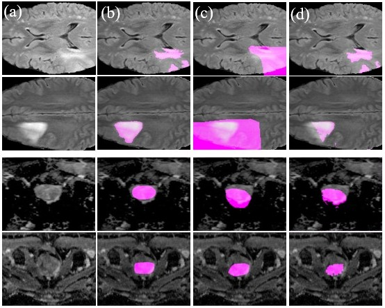

# MIDL_BoundaryCAM


## Abstract
Weakly Supervised Semantic Segmentation (WSSS) with only image-level supervision is
a promising approach to deal with the need of Segmentation networks, especially for
generating large number of pixel-wise masks in a given dataset. However, most state-
of-the-art image-level WSSS techniques lack an understanding of the geometric features
embedded in the images since the network cannot derive any object boundary information
from just image-level labels. We define a boundary here as the line separating the object and
background. To address this drawback, we propose our novel BoundaryCAM framework,
which deploys state-of-the-art class activation maps combined with various post-processing
techniques in order to achieve fine-grained higher-accuracy segmentation masks. To achieve
this, we investigate a wide-range of state-of-the-art unsupervised semantic segmentation
networks that can be used to construct a boundary map, which enables BoundaryCAM
to predict object locations with sharper boundaries. By applying our method to WSSS
predictions, we were able to achieve up to 10% improvements even to the benefit of the
current state-of-the-art WSSS methods for medical imaging.


## Getting Started

### Minimum requirements

1. Dependencies :

matplotlib 2.2.2
numpy 1.14.5
Pillow 5.2.0
scikit-image 0.14.0
scikit-learn 0.19.1
scipy 1.1.0
tensorboardX 1.2
torch 1.4.0
torchvision 0.5.0
nibabel

 2. Hardware :

### Download data

#### Dataset

1. The BraTS-2020 dataset can downloaded from this [link](https://www.med.upenn.edu/cbica/brats2020/data.html)
2. The preprocessed and 3-fold cross-validation split of prostate DECATHALON dataset WSS-CMER's link. [link](https://github.com/gaurav104/WSS-CMER).

Basic dataset folder structure, using Prostate dataset as an exemplary. (Note: Make sure to change the dataset directory accordingly inside the config file )


## Run BoundaryCAM on Decathlon
Please set all paths as mentioned at the top of every program.

1. Generate USS images
```bash
python deca_USS.py
```

2. Train an image classifier for generating CAMs
```bash
python deca_Classifier.py
```

3. Generate CAMs
```bash
python deca_GradCAM.py
```
4. Refine CAMs with BoundaryFit module
```bash
python deca_BOUNDARY_FIT.py
```
5. Evaluate the model
```bash
python deca_eval.py
```

## Run BoundaryCAM on BraTS
Please set all paths as mentioned at the top of every program.

1. Covert BraTS dataset
```bash
python brats_transformation.py
```

2. Generate USS images
```bash
python brats_USS.py
```

3. Train an image classifier for generating CAMs
```bash
python brats_Classifier.py
```

5. Generate CAMs
```bash
python brats_GradCAM.py
```
6. Refine CAMs with BoundaryFit module
```bash
python brats_BOUNDARY_FIT.py
```
7. Evaluate the model
```bash
python brats_eval.py
```

# Run BoundaryCAM on BUSI


1. Create USS segementations
```bash
python3 BUSI_USS.py
python3 BUSI_USS.py --segment quick
```
2. Generate CAMs
```bash
python3 Grad_cam.py
```
3. Refine CAMs with BoundaryFit module
```bash
python3 BoundaryFit_busi.py
```
4. Evaluate the model
```bash
python3 evaluate_busi.py
```

## Results
Qualitative segmentation results on BraTS and DECATHLON




## Acknowledgments
We gratefully thank the authors of https://github.com/shjo-april/PuzzleCAM, https://github.com/bnsreenu/python_for_microscopists/tree/master/231_234_BraTa2020_Unet_segmentation and https://github.com/yaleCat/Grad-CAM-pytorch from which some parts of our code are inspired.

